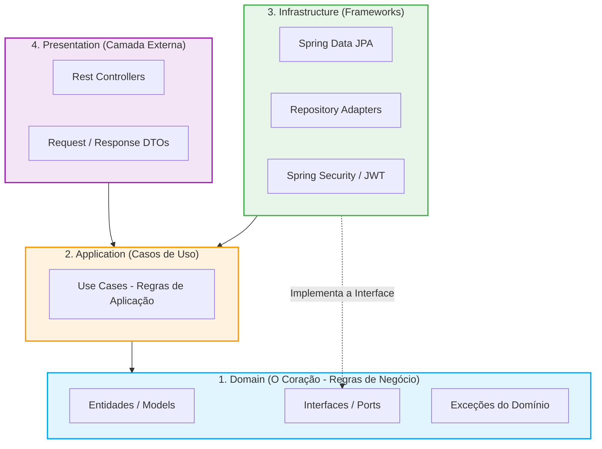
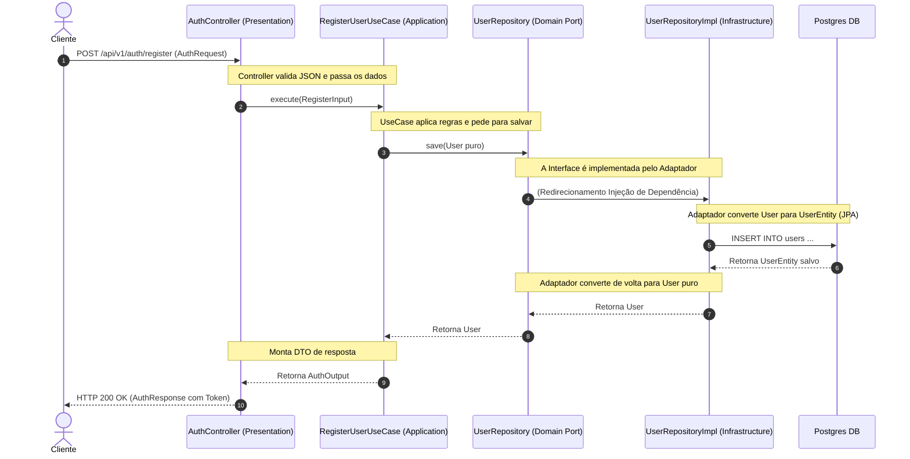

# Arquitetura do Auth Service (Clean Architecture)

Este documento explica de forma visual e estrutural como a **Clean Architecture** (Arquitetura Limpa) foi implementada neste projeto. A regra principal desta arquitetura é a **Regra da Dependência**: o código do centro não pode depender de nada que esteja do lado de fora.

---

## 🏗️ 1. Diagrama de Camadas (A Cebola)

Abaixo está a representação visual das camadas. A seta aponta para **quem depende de quem**. Note que o fluxo de dependência é sempre **de fora para dentro**. O Domínio (no centro) não depende de ninguém.

---

## 🔄 2. O Fluxo de uma Requisição (Como os dados caminham)

Como as coisas conversam na prática? Vamos ver o que acontece quando um usuário tenta fazer um "Registro" no sistema.

---

## 📂 3. Entendendo a Estrutura de Pastas

Aqui está a tradução do diagrama para as pastas do nosso código:

### `domain/` (A Camada 1)
O código mais importante da empresa. Escrito em Java puro.
* **`models/User.java`**: A Entidade do negócio. Representa um usuário real. Não tem `@Entity` ou qualquer dependência do Spring.
* **`repositories/UserRepository.java`**: É o "Porto" (Port). Um contrato que diz: *"Alguém precisa salvar esse usuário, não me importa se é no banco, no papel ou num arquivo"*.

### `application/` (A Camada 2)
Onde acontece a "Coreografia" do sistema.
* **`usecases/RegisterUserUseCase.java`**: O passo a passo da regra de negócio (Verifica e-mail -> Cria usuário -> Manda criptografar a senha -> Manda salvar).
* **`dto/`**: Objetos burros que servem apenas para passar dados de uma camada para a outra.

### `infrastructure/` (A Camada 3)
A camada que fala com o mundo externo e com o Spring Boot.
* **`persistence/entities/UserEntity.java`**: É a classe "suja", com as anotações do Hibernate (`@Entity`, `@Table`) para mapear o banco de dados Postgres.
* **`persistence/adapters/UserRepositoryImpl.java`**: É o "Adaptador" (Adapter). Ele assina aquele contrato do Domínio (`UserRepository`). É ele quem faz o trabalho sujo de pegar o objeto Java puro, converter para Entidade JPA e mandar o Spring Data salvar.
* **`mappers/UserMapper.java`**: Responsável por fazer a tradução de `User` para `UserEntity` e vice-versa.

### `presentation/` (A Camada 4)
A porta de entrada do nosso sistema.
* **`controllers/AuthController.java`**: Recebe o sinal da Internet (HTTP), pega o JSON, valida os campos e entrega para a camada `Application` (UseCase) fazer o trabalho.
* **`controllers/GlobalExceptionHandler.java`**: Traduz erros do Java (ex: `UserNotFoundException`) para respostas HTTP bonitas (ex: Erro 404).

---

## 💡 Resumo Final

Graças a esta estrutura:
1. Se amanhã o Itaú decidir trocar o banco de dados (ex: MongoDB), **alteramos apenas a camada Infrastructure**. O Domínio e os Casos de Uso ficam intocados.
2. Se amanhã mudarmos de API REST (HTTP) para um bot do Telegram, **alteramos apenas a camada Presentation**. O resto não muda.
