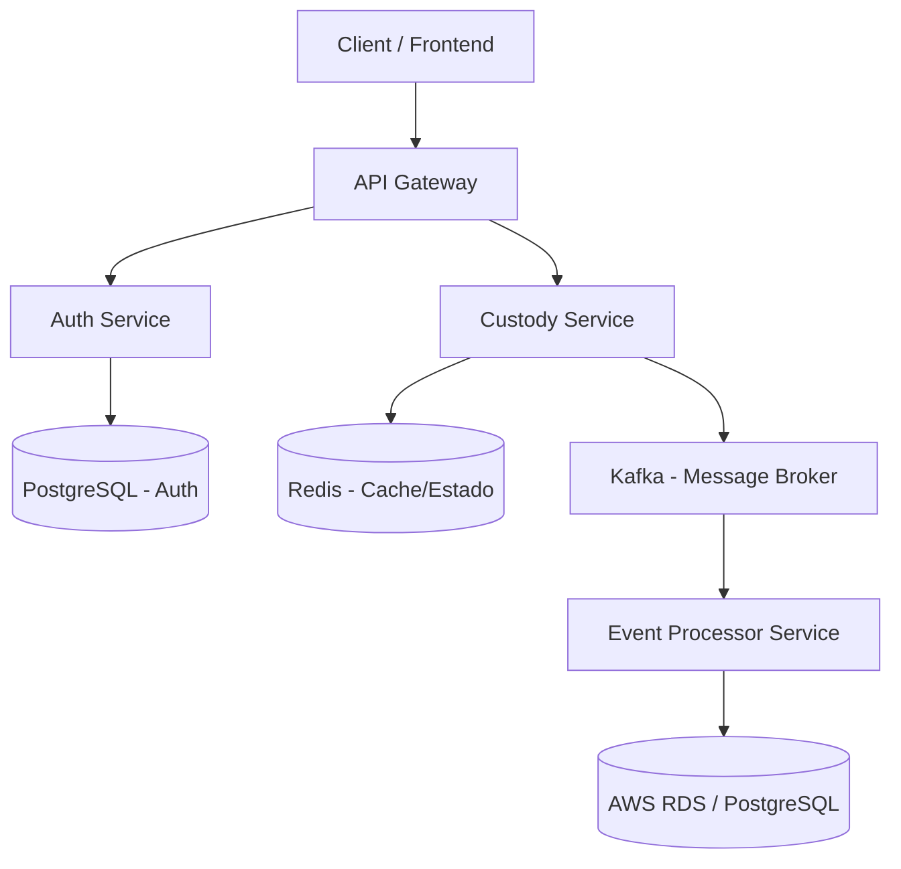

# Plano de Projeto: Plataforma de Custódia de Ativos

## 1. Visão Geral
O projeto é uma **Plataforma de Custódia de Ativos** construída com uma arquitetura de microsserviços orientada a eventos (Event-driven). O objetivo é criar um sistema robusto, escalável e de alta qualidade, aplicando as melhores práticas de engenharia de software (Clean Architecture, SOLID, DDD) e utilizando uma stack tecnológica moderna baseada em ecossistema Java.

## 2. Arquitetura do Sistema
Com base na imagem fornecida e na stack tecnológica, a arquitetura será composta pelos seguintes componentes:

### Componentes:
- **API Gateway**: Ponto único de entrada, roteamento e possivelmente rate limiting.
- **Auth Service**: Responsável pela autenticação e autorização (Spring Security, JWT). Banco de dados relacional próprio (PostgreSQL).
- **Custody Service**: Serviço principal onde ocorrem as operações de custódia. Utiliza **Redis** para alta performance (cache ou controle de concorrência) e publica eventos de domínio no **Kafka**.
- **Event Processor**: Consome os eventos do Kafka de forma assíncrona, processa as regras de negócio finais e persiste o estado definitivo no banco de dados principal (**AWS RDS**).

## 3. Stack Tecnológico

| Categoria | Tecnologias |
| :--- | :--- |
| **Backend** | Java 21+, Spring Boot, Spring Security, JPA |
| **Bancos de Dados & Mensageria** | PostgreSQL (RDS), Redis, Kafka |
| **Qualidade & Testes** | JUnit, Mockito, Testcontainers, Integration Tests, E2E |
| **Arquitetura & Design** | Clean Architecture, SOLID, DDD, Microservices, Event-driven |
| **Cloud & Infraestrutura** | AWS, Docker, ECS, S3 |
| **DevOps** | GitHub Actions, CI/CD, SonarQube |
| **Observabilidade** | Spring Boot Actuator, OpenTelemetry, Prometheus, Grafana, CloudWatch |

## 4. Fases de Desenvolvimento

Para não nos perdermos na complexidade, dividiremos o desenvolvimento em fases lógicas:

### Fase 1: Setup da Infraestrutura Local e Fundação
- [ ] Configurar repositório (Git).
- [ ] Criar o arquivo `docker-compose.yml` para rodar localmente: PostgreSQL, Redis e Kafka.
- [ ] Definir a estrutura base dos projetos (multi-module Maven/Gradle ou repositórios separados).

### Fase 2: Segurança e API Gateway
- [ ] Criar o **API Gateway** (Spring Cloud Gateway).
- [ ] Criar o **Auth Service** aplicando DDD e Clean Architecture.
- [ ] Implementar autenticação via JWT com Spring Security.
- [ ] Testes unitários e de integração com Testcontainers (Postgres).

### Fase 3: Core do Negócio (Custody Service)
- [ ] Desenvolver o **Custody Service**.
- [ ] Modelar o domínio (Ativos, Ordens de Custódia, Carteiras) usando DDD.
- [ ] Integrar com Redis para cache rápido.
- [ ] Configurar os produtores (producers) do Kafka para publicar eventos de custódia.

### Fase 4: Processamento Assíncrono (Event Processor)
- [ ] Desenvolver o **Event Processor**.
- [ ] Configurar consumidores (consumers) do Kafka.
- [ ] Processar os eventos e persistir no banco de dados principal usando JPA.

### Fase 5: Observabilidade e Cloud
- [ ] Adicionar OpenTelemetry, Prometheus e Grafana para tracing e métricas.
- [ ] Preparar os Dockerfiles.
- [ ] Criar as pipelines de CI/CD usando GitHub Actions e SonarQube.
